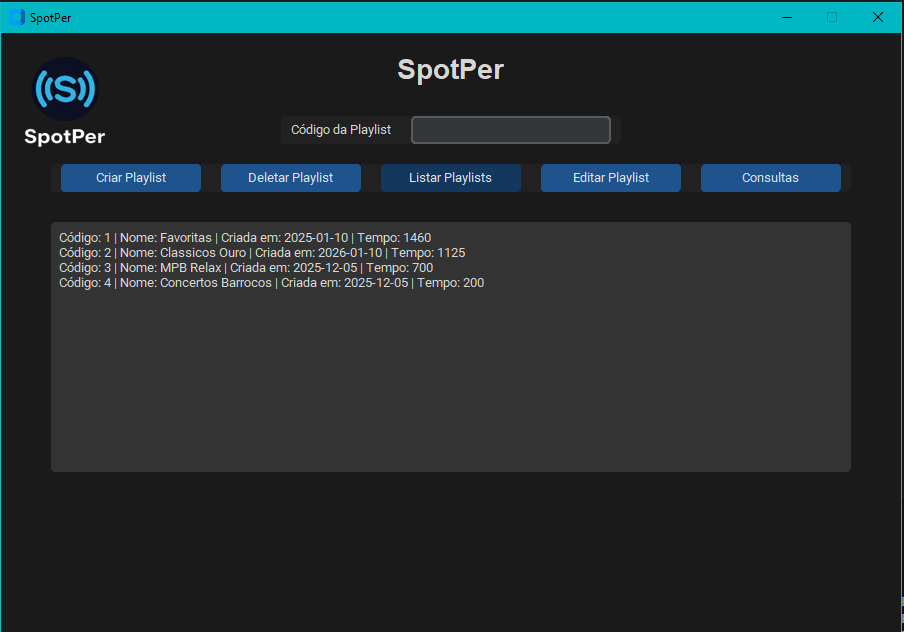
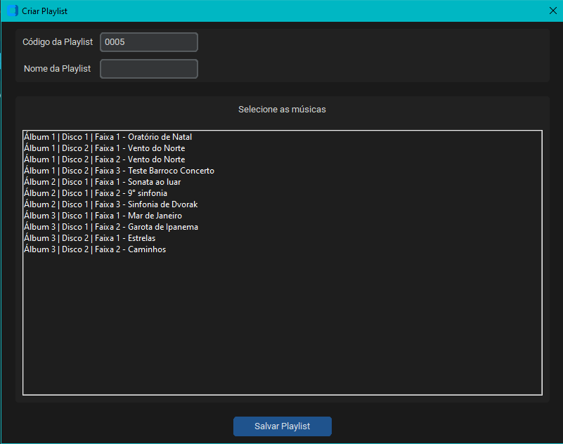
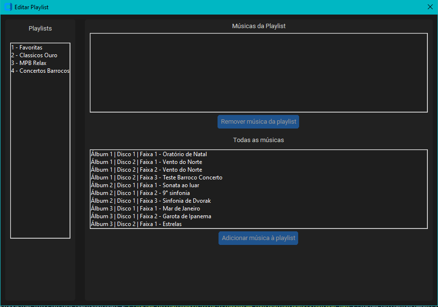

# SpotPer 

Projeto desenvolvido na disciplina **Fundamentos de Banco de Dados (FBD)**  
📅 Semestre: **2025.2**  
🏫 **Universidade Federal do Ceará (UFC)** — Departamento de Computação (DC)

---

## Equipe:
- **Américo Vitor Moreira Barbosa**
- **Caio Emanuel de Oliveira Lima**

**Professor:** Ângelo Roncalli Alencar Brayner

---

## Sobre o Projeto
O **SpotPer** é um projeto acadêmico desenvolvido para a disciplina de **Fundamentos de Banco de Dados**.  Ele simula uma plataforma simples de streaming musical, com suporte a **álbuns, faixas e playlists**.

O foco principal do projeto é a **modelagem, criação e manipulação de banco de dados relacional**.

---

## Ferramentas Utilizadas
**Backend:** Python  
**Banco de Dados:** SQL Server 

---

##  Como Executar
1. Crie e inicialize o banco usando o script:
   ```
   scriptDeCriacaoDoBD.sql
   ```
2. Verifique se o banco está ativo e acessível.
3. Baixe as bibliotecas python utilizadas
   ```
   pip install -r requirements.txt
   ```
4. Após instaladas as dependências inicie o main
   ```
   python main.py
   ```
5. Aparecerá então o aplicativo SpotPer com todas as funcionalidades


---

## Funcionalidades do Aplicativo
<p align="center">

</p>

1. **TELA PRINCIPAL**


Na tela principal temos como:
- Criar Playlist (Abre uma janela que possibilita uma playlist)
- Deletar Playlist (Colocando o código da playlist a playlist é excluida)
- Listar Playlist  (Lista todas as playlists existentes na tela principal)
- Editar Playlist (Abre uma janela que permite adicionar e remover faixas)
- Consultas (Consultas requisitadas no trabalho)




2. **TELA CRIAR PLAYLIST**


Na tela de criar playlist:
- Podemos selecionar as faixas existentes que estão agrupadas por álbum
- Colocar um nome para a playlist

3. **TELA EDITAR PLAYLIST**



Na tela de editar playlist:
- Podemos selecionar a playlist e ADICIONAR ou REMOVER faixas


## POSSIVEIS PROBLEMAS AO RODAR O CÓDIGO

Caso apresente algum erro sobre o driver ou conexão com o banco de dados, toda essa parte encontra-se no **com_sql.py**, Verifique se:
- O nome do servidor do banco de dados está correto
- Driver de comunicação está instalado 

Essa é a função responsável por isso:
```
def conectarBD():
    return pyodbc.connect(
        "DRIVER={ODBC Driver 18 for SQL Server};"
        "SERVER=localhost;"
        "DATABASE=SpotPer;"
        "TrustServerCertificate=yes;"
        "Trusted_Connection=yes;"
    )
```